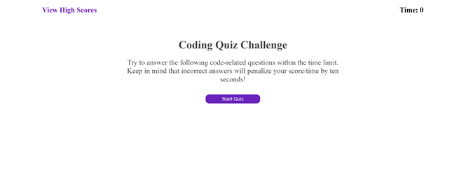
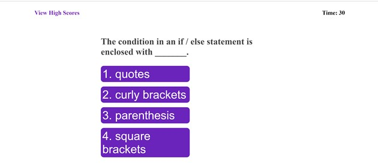
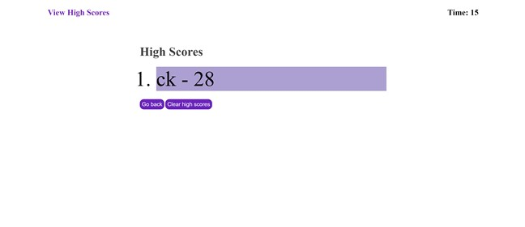

# Code-Quiz

## Descrpition 
The Coding Quiz Challenge is a website that challenges the user to answer a set of questions about the programming language, Javascript.

The website will begin by displaying the rules of the quiz, a timer, a "view High Scores" button, and a "start Quiz" button. When pressing the "start Quiz" button, the timer will set for 30 seconds and the page will display a question and a series of answer options.

When clicking on a answer button, the page will then display the next question and show whether the user was right or wrong to the previous question at the bottom of the page. If a question is answered incorrectly, then the timer will lose 10 seconds. 

Once all the questions have been answered or the timer runs out, the quiz will end. The screen will then display the users score and asks that they enter their initials. Once entering the user's initals, the page then displays the previous highscores and allows for the score to be cleared and for the quiz to begin again.

## Installation
link to website:
link to GitHub: https://github.com/ckrum21 

Install this website by cloning the code to your local devices.

software required to download this website:
* GitBash or other terminal
* Visual Studio Code

## Usage

The code used for this webpage is HTML, CSS, and JavaScript. The code for this website is used to display questions and answers to conduct a quiz. 
## Credits
Chelsea Krum 